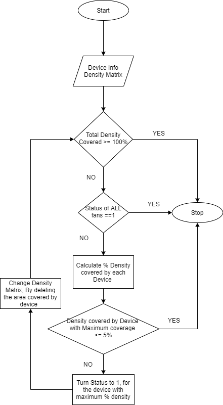

## Decision Making Algorithm
### Coverage Function
```
This is a helper function.This function takes Device structure as input and outputs Matrix with zero's and one's. 
The area with one's is the area covered by that device. 
```

### Percentage covereage
```
This is a helper function.This function takes Device structure and Density matrix as input and 
calculates the fraction of area coverd by that device.
```

### New Density
```
This function makes thakes the current Density and then makes the values of area covered by the device 0. 
This calls Coverage function for getting the coverage matrix of the 
device.
```
 
### Decision Making Algorithm
```

```