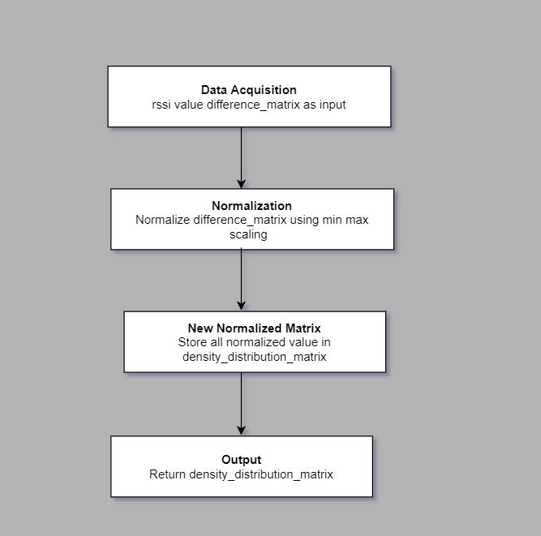

## RSSI to Density Matrix
### Algorithm for population / density distribution matrix: 
<b>•</b>	Start 

<b>•</b>	Get the rssi difference matrix in difference_matrix of order [i]x[j] 

<b>•</b> Let d[i][j] represent each element of difference_matrix 

<b>•</b>	Min(d) and Max(d) are minimum and maximum values of d[i][j] respectively 

<b>•</b>	Let D[i][j] represent each element of density_distribution_matrix of order [i]x[j] 

<b>•</b>	For each value of d[i][j] 

<b>•</b>	Do,    D[i][j] = (d[i][j] – Min(d)) / (Max(d) – Min(d)) 

<b>•</b> Store all values of D[i][j] in density_distribution_matrix 

<b>•</b> Return density_distribution_matrix 

<b>•</b>	End  
### Data flow diagram (DFD):

