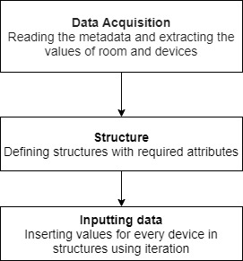

# Metadata to matrix form
## Algorithm:
<b>Step 1:</b> Start 

<b>Step 2:</b> Create a header file. 

<b>Step 3:</b> Open the metadata file which consists of details of Room and devices (fans and lights) in numeric values separated by commas for different member of structure and separated by line for different 	structure or arrays of structure.  

<b>Step 4:</b> Create Structure Room with members. 

* Column 
* Row  
* Numberoffans 
* Numberoflights 

<b>Step 5:</b>  Create Structure Device with members 

* status   
* radius  
* pos  
* Den  
* Power 

<b>Step 6:</b> Read the metadata file and insert the values of room in structure Room. 

<b>Step 7:</b>  For Loop is created for fan with i=0. 

<b>Step 8:</b>  Read the values of fan i from metadata file and insert in structure Device.   

<b>Step 9:</b>  Repeat step 8 for all fans until the number of iterations is equal to numberoffans in room. 

<b>Step 10:</b>  For Loop is created for light with j=i. 

<b>Step 11:</b>  Read the values of light j from metadata file and insert in structure Device.   

<b>Step 12:</b>  Repeat step 11 for all lights until the number of iterations is equal to numberoflights in room. 

<b>Step 13:</b>  Close the metadata file

<b>Step 14:</b>  Stop   

## Data-Flow Diagram:   
   

## Flowchart:  

